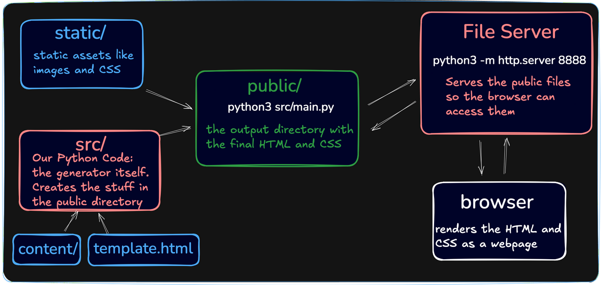

# Static Site Generator
---
## Architecture
---

The flow of the data through the full system is:

1. Markdown files are in the /content directory. A template.html file is in the root of the project.
2. The static site generator (the Python code in src/) reads the Markdown files and the template file.
3. The generator converts the Markdown files to a final HTML file for each page and writes them to the /public directory.
4. We start the built-in Python HTTP server (a separate program, unrelated to the generator) to serve the contents of the /public directory on http://localhost:8888 (our local machine).
5. We open a browser and navigate to http://localhost:8888 to view the rendered site.

### How the SSG works

The vast majority of our coding will happen in the src/ directory because almost all of the work is done in steps two and three above.
Here's a rough outline of what the final program will do when it runs:

1. Delete everything in the /public directory.
2. Copy any static assets (HTML template, images, CSS, etc.) to the public directory.
3. Generate an HTML file for each markdown file in the /content directory. For each Markdown file:
    1. Open the file and read its contents.
    2. Split the markdown into "blocks" (e.g. paragraphs, headings, lists, etc.)
    3. Convert each block into a tree of HTMLNode objects. For inline elements (like bold text, links, etc.) we will convert:
        - Raw markdown -> TextNode -> HTMLNode
    4. Join all of the HTMLNode blocks under one large parent HTMLNode for the pages.
    5. Use a recursive to_html() method to convert the HTMLNode and all of its nested nodes to a giant HTML string and inject it into the HTML template.
    6. Write the full HTML string to a file for that one page in the /public directory.

### How We're Going to Build It

We're not going to _build_ the program in the same order that it _runs_...that's often not the best way to build large projects. Instead, we'll tackle individual problems that we know we'll need to solve and use unit tests to make sure they work as expected. Then we'll put the pieces together into a working program as we get closer to the end.

**_You don't need to memorize the information on this page, but come back to review it if you ever feel lost in the details._**
